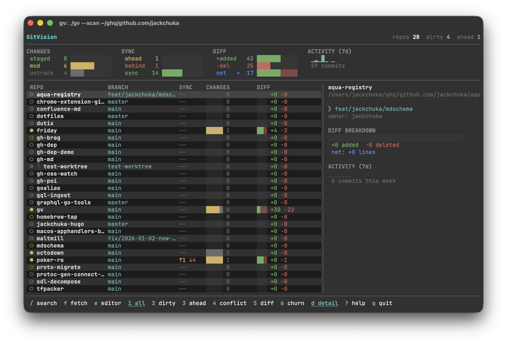

<div align="center">

```
┌──────────────────────┐
│  ╔═╗╦  ╦             │
│  ║ ╦╚╗╔╝             │
│  ╚═╝ ╚╝   Git Vision │
└──────────────────────┘
```

TUI dashboard for monitoring multiple git repositories and worktrees.
Auto-discovers git repos under configured paths and shows their status in real-time.

</img>

</div>

## Features

- **Auto-discovery** — Scans configured directories for git repos and worktrees
- **Live status** — Branch, dirty state, staged/modified/untracked counts, ahead/behind tracking
- **Diff insights** — Lines added/removed, net delta, and file churn per repo
- **Activity sparklines** — Visualize recent commit activity at a glance
- **Worktree aware** — First-class support for git worktrees alongside regular repos
- **Conflict detection** — Surface merge conflicts across all your repos
- **Background polling** — Automatic refresh detects changes as you work
- **Vim-style navigation** — `hjkl`, half-page scrolling, filter, and more

## Install

```bash
go install github.com/jackchuka/gv@latest
```

Or build from source:

```bash
git clone https://github.com/jackchuka/gv.git
cd gv
make install
```

## Quick Start

```bash
gv init
```

The interactive wizard walks you through setup — just enter the directories where you keep your git repos. It writes `~/.config/gv/config.yaml` for you.

Then launch the dashboard:

```bash
gv
```

## Usage

```bash
gv                          # launch the dashboard
gv init                     # interactive config setup
gv --scan ~/extra/path      # override config and scan this path only
gv --config /path/to/conf   # use a custom config file
```

## Configuration

Config lives at `~/.config/gv/config.yaml` (respects `$XDG_CONFIG_HOME`).

```yaml
scan_paths:
  - ~/code
  - ~/projects
  - ~/work

ignore_patterns:
  - "**/node_modules/**"
  - "**/vendor/**"
  - "**/.venv/**"

max_depth: 10 # directory scan depth (default: 10)
poll_interval: 5s # status check interval (default: 5s)
auto_refresh: true # enable background polling (default: true)
```

Common directories like `node_modules`, `vendor`, `.cache`, `__pycache__`, `build`, and `dist` are ignored by default.

## Keybindings

### Navigation

| Key          | Action         |
| ------------ | -------------- |
| `j` / `↓`    | Move down      |
| `k` / `↑`    | Move up        |
| `g` / `Home` | Jump to top    |
| `G` / `End`  | Jump to bottom |
| `Ctrl+d`     | Half page down |
| `Ctrl+u`     | Half page up   |
| `/`          | Filter repos   |
| `Esc`        | Clear filter   |

### Actions

| Key | Action               |
| --- | -------------------- |
| `r` | Reload selected repo |
| `f` | Fetch selected repo  |
| `F` | Fetch all repos      |
| `e` | Open in `$EDITOR`    |
| `o` | Open in Finder       |
| `y` | Copy repo path       |
| `:` | Run shell command    |

### Views & Sorting

| Key | Action                     |
| --- | -------------------------- |
| `1` | Show all repos             |
| `2` | Show dirty repos only      |
| `3` | Show repos ahead of remote |
| `4` | Show repos with conflicts  |
| `5` | Sort by diff volume        |
| `6` | Sort by file churn         |
| `d` | Toggle detail panel        |
| `?` | Help                       |

## How It Works

gv walks your configured scan paths looking for `.git` directories and worktree links. It runs `git status --porcelain=v2` and supplementary commands concurrently to build a status snapshot of each repo, then polls for changes in the background using content hashing to minimize overhead.

## Requirements

- Go 1.23+
- Git

## License

MIT
